<p align="center">
  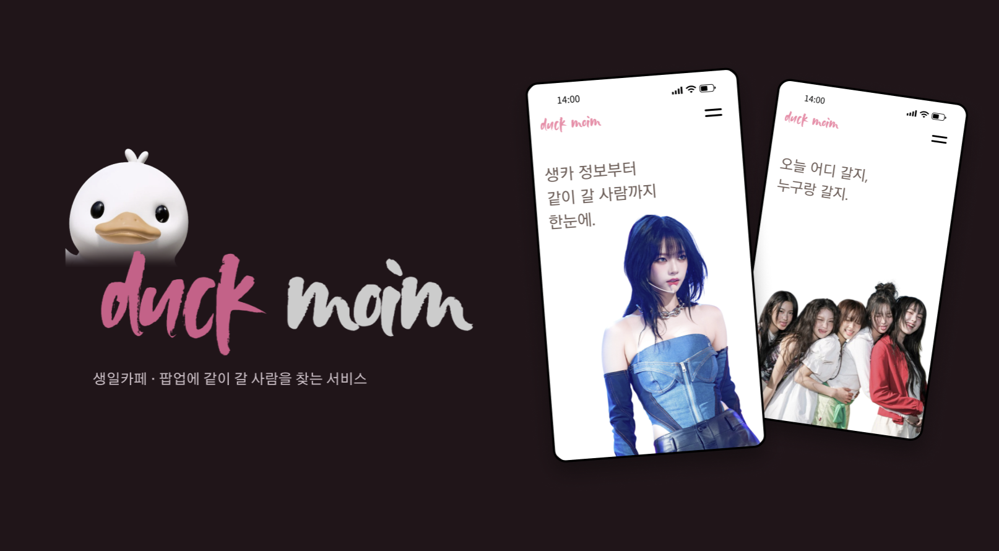
</p>

<h1 align="center">덕모임</h1>

<p align="center">
  <a href="https://github.com/potenup-final/duckmoim-backend/actions/workflows/ci-cd.yml"></a>
  <a href="https://github.com/potenup-final/duckmoim-backend/actions/workflows/api-docs.yml"></a>
  
  
  
  
</p>

<p align="center">
  <a href="https://duckmoim.com">서비스</a> ·
  <a href="https://potenup-final.github.io/duckmoim-backend/">API 문서</a> ·
  <a href="https://github.com/potenup-final/duckmoim-wiki">위키</a> ·
  <a href="https://github.com/potenup-final/duckmoim-frontend">프론트엔드</a>
</p>

## 소개

생일카페와 팝업은 혼자 가기 애매합니다. \
줄서기, 사진, 특전 조건은 둘 이상이어야 맞출 수 있습니다. \
그런데 같이 갈 사람을 구하는 곳은 사실상 X 하나입니다.

덕모임은 행사 정보 위에 동행 모집을 얹었습니다. \
서울 생일카페와 팝업을 위치 기준으로 모으고, 행사마다 모집글과 채팅을 붙였습니다. \
미성년자가 낯선 사람과 만나는 서비스라 신고, 제재, 감사 기록을 먼저 만들었습니다.

## 시연 영상

<!--
  GitHub 에서 바로 재생되게 하려면 README 편집 화면에 demo.mp4 를 드래그해서 넣습니다.
  생기는 user-attachments 주소 한 줄을 이 자리에 붙이면 됩니다.
-->
<p>
  <a href="docs/assets/demo.mp4">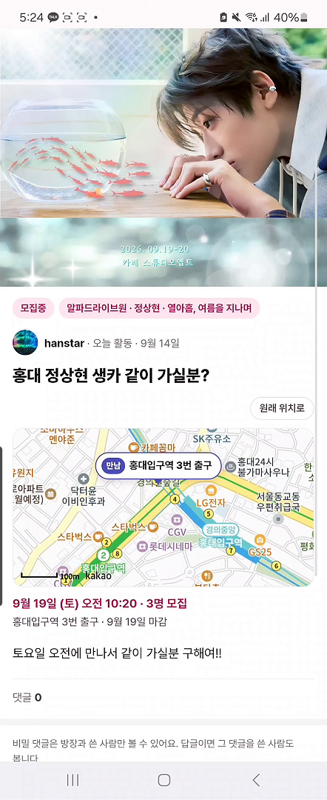</a><br>
  <sub>가입부터 동행 채팅까지, 1분 23초</sub>
</p>

## 주요 기능

<p>
  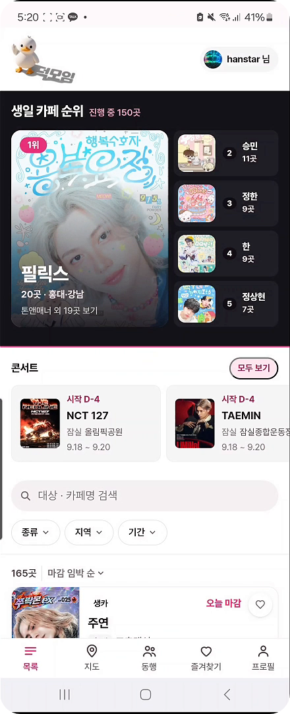
  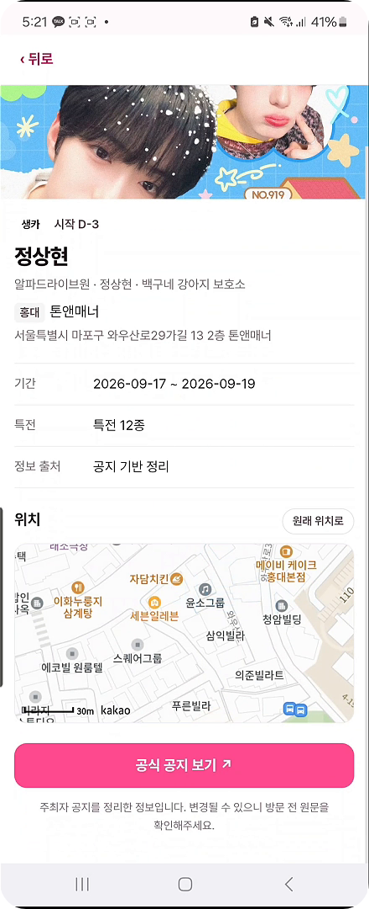
  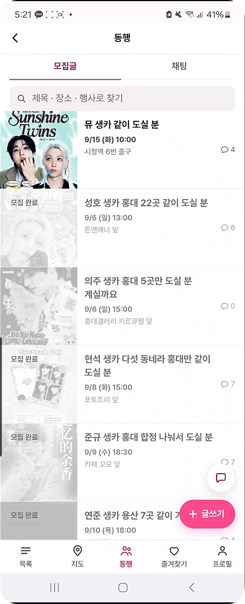
  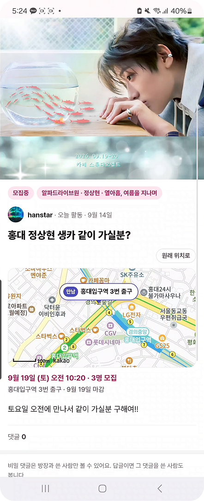
  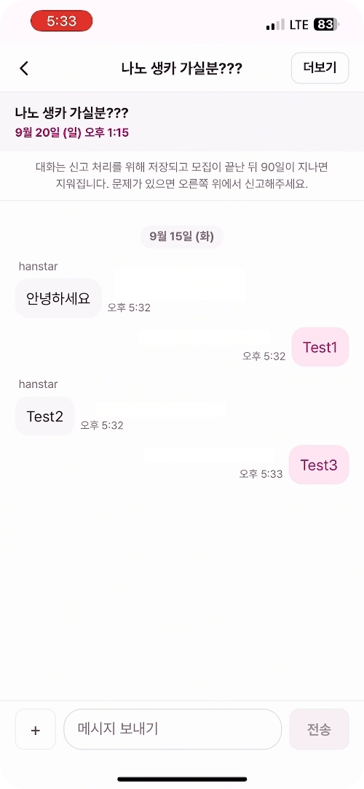
</p>
<p><sub>홈 · 행사 상세 · 동행 목록 · 모집글 · 채팅</sub></p>

| 1차 배포 | 2차 배포 |
| --- | --- |
| 카카오 로그인, 프로필 | 채팅방, 메시지, 사진 |
| 위치 기준 행사 조회 | 실시간 수신 (SSE) |
| 모집글, 댓글, 비밀 댓글 | 알림함, 웹 푸시 |
| 신고, 제재, 백오피스 | 읽음 표시, 채팅 신고 |

## PoC

주제를 정하기 전에 후보 셋을 실제로 만들어 주말 하루씩 열어 뒀습니다.

<p>
  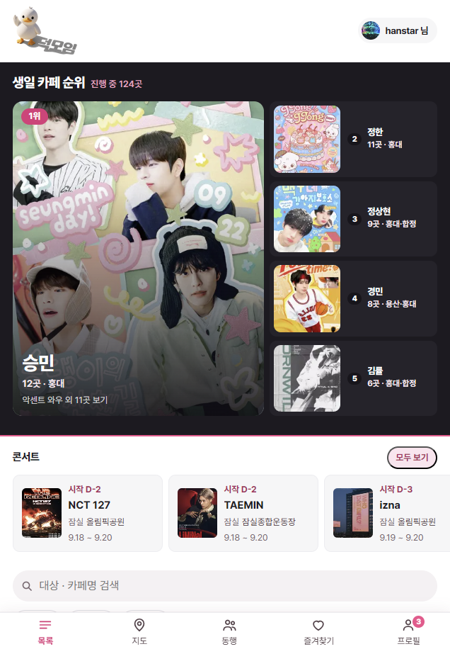
  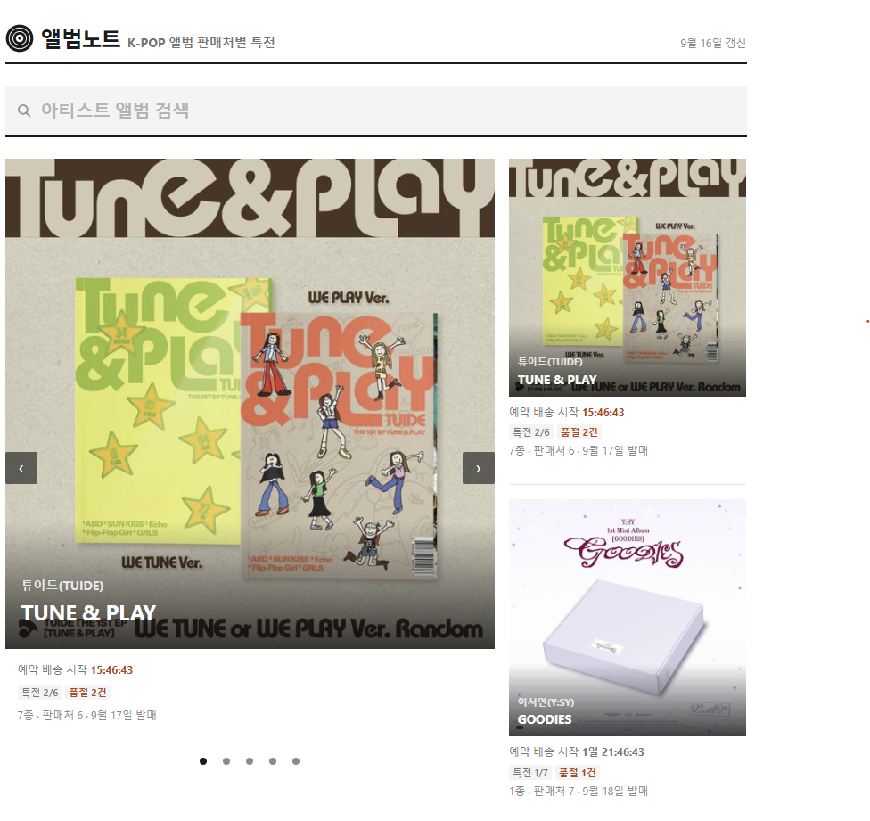
  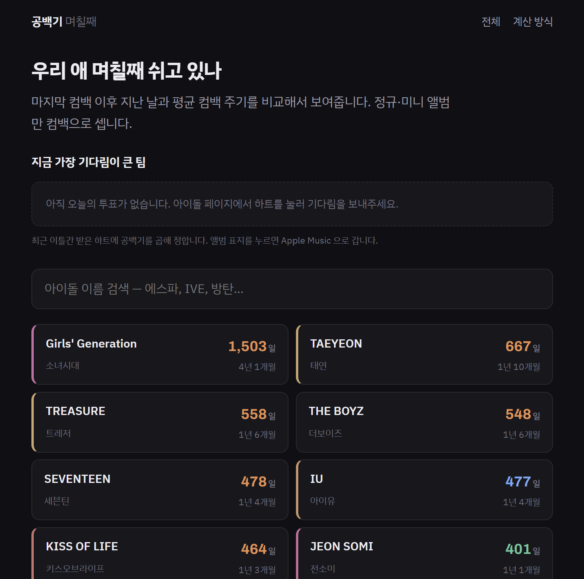
</p>

| 후보 | 하루 방문 | 체류 |
| --- | --- | --- |
| 생일카페 정보 | 155 | 약 2분 |
| 앨범 특전 정보 | 31 | 1분 미만 |
| 컴백 카운트다운 | 23 | 1분 미만 |

<p>
  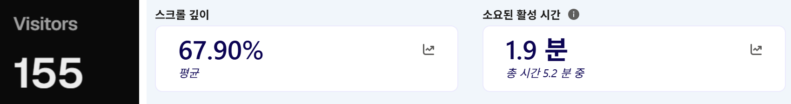
</p>

방문 5배, 체류 2배 차이로 생일카페와 팝업을 축으로 정했습니다.

## 팀원

<table>
  <tr>
    <td align="center"><a href="https://github.com/ssggii"><br><b>한슬기</b></a><br>백엔드</td>
    <td align="center"><a href="https://github.com/J-DONGHYUN"><br><b>장동현</b></a><br>백엔드</td>
    <td align="center"><a href="https://github.com/Aru428"><br><b>권소희</b></a><br>백엔드</td>
    <td align="center"><a href="https://github.com/parkhb1181"><br><b>박호빈</b></a><br>프론트엔드 · 기획</td>
  </tr>
</table>

팀 너 스타야? · 2026.08.24 ~ 09.17 · 주 단위 스프린트 4회

## 시스템 아키텍처

<p>
  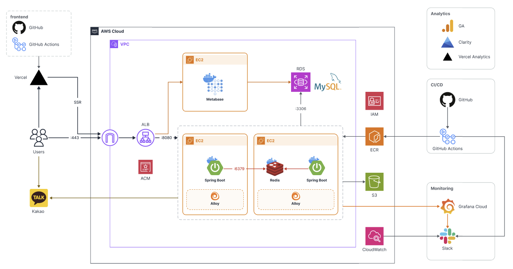
</p>

- 프론트 Next.js, Vercel. 백엔드와 도메인이 달라 Refresh 토큰을 쿠키에 두지 않습니다
- API ALB 뒤 EC2 두 대, Spring Boot, 블루/그린 배포
- 데이터 RDS MySQL 8.4, Redis(SSE 팬아웃), S3(채팅 사진)
- 행사 등록은 크롤러가 합니다
- 관측 Alloy → Grafana Cloud, CloudWatch → Slack, Metabase, GA, Clarity

## 도메인 구조

바운디드 컨텍스트 7개. \
트래픽 패턴, 인증 경계, 캐싱 전략 중 하나라도 다르면 나눴습니다.

| 컨텍스트 | 등급 | 패키지 | 맡는 것 | 요구사항 ID | 마이그레이션 |
| --- | --- | --- | --- | --- | --- |
| Identity | 핵심 | `identity`, `auth` | 로그인, 토큰, 프로필 | AU | V10 ~ |
| Companion | 핵심 | `companion` | 모집글, 댓글 | PO, CM | V20 ~ |
| Chat | 핵심 | `chat` | 채팅방, 메시지, 사진 | CH | V700 ~ |
| Catalog | 지원 | `catalog` | 행사, 지역 | EV | V1 ~ |
| Safety | 지원 | `safety` | 신고, 제재, 감사 기록 | SF | V30 ~ |
| Notification | 지원 | `notification` | 알림, 아웃박스, 웹 푸시 | NT | V800 ~ |
| Admin | 일반 | `admin` | 백오피스 인가 | AD | V30 ~ |

- 알림은 아웃박스로 떼어내 도메인 트랜잭션을 붙잡지 않습니다
- 닉네임 유일성은 사전 조회와 DB 제약으로 두 번 막습니다
- Admin이 의존하는 곳은 Safety 하나뿐입니다

## 기술적 결정

자세한 근거는 [위키](https://github.com/potenup-final/duckmoim-wiki)의 ADR에 있습니다.

### 워커 선점

서버 두 대의 아웃박스 워커가 같은 행을 집었습니다. 200건 중 162건 충돌. \
후보 둘을 전용 테스트로 실측했습니다.

| 방식 | 충돌 | 200건 비우기 | 발행 지연 |
| --- | --- | --- | --- |
| 선점 없음 | 162 | 996ms | 없음 |
| `SKIP LOCKED` + 리스 | 0 | 577ms | 12ms |
| 조건부 `UPDATE` + 리스 | 0 | 714ms | 18ms |

### 채팅 전송, SSE

폴링, 롱 폴링, SSE, WebSocket을 비교했습니다. \
양방향이 필요 없다는 게 결정적이었습니다. 보내는 건 POST, 받는 것만 서버가 밀어줍니다. \
WebSocket은 상태를 가져서 블루/그린의 전제인 무상태와 맞지 않았습니다.

대가. 연결이 인스턴스 메모리에만 있어 Redis 팬아웃이 서버 사이를 잇습니다. \
스트림이 5xx면 30초 폴링으로 버티고, 끊긴 구간은 `Last-Event-ID`로 채웁니다.

### 무중단 배포와 마이그레이션

배포 중 구버전과 신버전이 같이 돕니다. \
스키마 변경을 확장 단계와 수축 단계로 나눴습니다. \
컬럼 하나 바꾸는 데 배포가 여러 번 필요해진 게 대가입니다.

### 백오피스 인가

요구사항은 "별도 계정" 한 줄이었습니다. \
인증은 카카오, 인가는 `AdminAccount` 화이트리스트로 했습니다. \
자체 계정이면 비밀번호 관리와 유출 대응이 전부 우리 몫이 되고, 그 문 안에 비밀 댓글이 있기 때문입니다. \
감사 기록은 추가만 되고 고치거나 지울 수 없습니다.

## 품질 게이트

규칙을 문서에서 빌드로 옮겼습니다. 어기면 빌드가 깨지고 머지가 안 됩니다.

| 게이트 | 막는 것 |
| --- | --- |
| Spotless | 포맷 |
| Checkstyle | 로그에 남기면 안 되는 값 (본문, 닉네임, 출생연도, 토큰) |
| ArchUnit | 레이어 의존 방향, 트랜잭션 위치 |
| 위키 참조 검증 | 코드가 인용한 위키 경로가 실제로 있는지 |

- 자동 테스트 2,091건
- `develop`은 빌드만, `main`은 ECR 푸시 후 블루/그린 배포
- 운영 Swagger는 닫고, 스펙을 CI에서 뽑아 [정적 페이지](https://potenup-final.github.io/duckmoim-backend/)로 배포

## AI 협업

잘 부탁하는 법 대신, 다시 설명하지 않아도 되게 저장소를 설정했습니다. \
`CLAUDE.md`, 커밋 훅, 위키 참조가 그 자리입니다.

```
[0] 티켓 제목에서 요구사항 ID 를 읽는다
[1] ID → 위키 → 통과해야 하는 테스트 목록
[2] 계획을 이슈에 올린다            ← 사람이 본다
[3] 계획 한 줄 = 커밋 하나          ← 사람이 본다
[4] ./gradlew check  실패하면 [3] 으로
[5] PR
```

사람이 보는 자리는 계획과 커밋 두 곳입니다. \
자세한 내용은 [docs/harness/backend.md](docs/harness/backend.md)에 있습니다.

## 프로젝트 구조

```
src/main/java/com/duckmoim
├── identity      회원, 프로필
├── auth          카카오 로그인, 토큰
├── catalog       행사, 지역
├── companion     모집글, 댓글
├── chat          채팅방, 메시지, 사진, SSE
├── safety        신고, 제재, 감사 기록
├── notification  알림, 아웃박스, 웹 푸시
├── admin         백오피스 인가
└── common        공통
src/main/resources/db/migration   Flyway
docs/wiki                         요구사항, 불변식, ADR (서브모듈)
docs/harness/backend.md           AI 작업 루프
config/checkstyle/                로그 금지 값 규칙
.github/workflows/                CI/CD, API 문서, Jira 연동
```

## 시작하기

```bash
git clone --recurse-submodules https://github.com/potenup-final/duckmoim-backend.git
cd duckmoim-backend
cp .env.example .env
docker compose up -d          # MySQL 8.4, Redis
./gradlew bootRun             # localhost:8080
```

```bash
./gradlew build               # 포맷, 컨벤션, 아키텍처, 테스트. CI 와 같다
./gradlew spotlessApply       # 포맷 자동 수정
```

## 기술 스택

<p>
  
  
  
  
  
  
</p>
<p>
  
  
  
</p>
<p>
  
  
  
  
  
  
</p>
<p>
  
  
  
  
</p>

## 문서

- [위키](https://github.com/potenup-final/duckmoim-wiki) 요구사항 ID, 불변식, ADR, 회의록
- [API 문서](https://potenup-final.github.io/duckmoim-backend/) CI가 추출한 OpenAPI 스펙
- [AI 작업 루프](docs/harness/backend.md)
- [프론트엔드 저장소](https://github.com/potenup-final/duckmoim-frontend)
